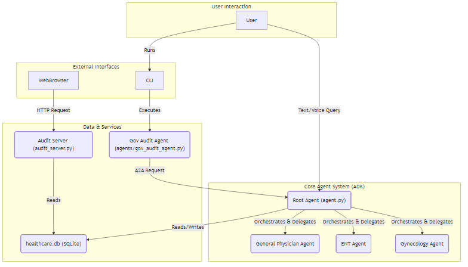

# Healthcare AI Agent

## 1. Problem Statement

In the current healthcare landscape, patients often face challenges in getting timely and accurate medical information. It can be difficult to know which type of specialist to consult for a specific symptom, leading to delays in receiving appropriate care. Additionally, maintaining a secure and easily auditable record of patient interactions is a critical requirement for healthcare providers.

## 2. Solution

This project, the "Healthcare AI Agent," is a prototype of a hierarchical AI agent system designed to address these challenges. It provides a conversational interface for patients to ask health-related questions. The system can provide general medical information and, when necessary, route the query to a specialized AI agent (e.g., ENT, Gynecology) for more specific guidance.

All interactions are logged in a secure database, and a separate web interface provides a read-only audit trail for authorized personnel. This ensures that a complete and accurate record of patient interactions is maintained.

## 3. Architecture

The project is built using the Google Agent Development Kit (ADK) and follows a hierarchical agent architecture. This modular design allows for easy expansion and specialization of agent capabilities.

The main components of the system are:

*   **Root Agent (`agent.py`):** The primary entry point of the application. It handles user interactions, orchestrates the sub-agents, and manages the database.
*   **Sub-agents (`subagents/`):** Specialized agents for different medical domains, such as:
    *   General Physician
    *   ENT (Ear, Nose, and Throat)
    *   Gynecology
*   **Database (`healthcare.db`):** A SQLite database used to store patient records and other relevant data.
*   **Audit Server (`audit_server.py`):** A FastAPI web server that provides a read-only interface for auditing patient records from the database.
*   **Government Audit Agent (`agents/gov_audit_agent.py`):** A specialized agent that demonstrates secure Agent-to-Agent (A2A) communication for auditing purposes. It requests data from the root agent, which enforces access control.

### Architecture Diagram



## 4. Setup and Installation

### Prerequisites

*   Python 3.10+
*   pip
*   Node.js and npm (for generating the architecture diagram)

### Installation

1.  Clone the repository:
    ```bash
    git clone <repository-url>
    cd Healthcare_AI
    ```

2.  Install the required Python packages:
    ```bash
    pip install -r requirements.txt
    ```

## 5. How to Run

### 1. Main Agent

To run the main interactive agent, execute the following command:

```bash
python agent.py
```

### 2. Audit Server

To start the audit server, run the following command:

```bash
uvicorn audit_server:app --reload
```

The audit server will be available at `http://127.0.0.1:8000`.

**Note on Virtual Environment Usage:**
If you encounter issues where `uvicorn` does not start or reports missing packages (e.g., `jinja2`), it might be due to `uvicorn` not picking up the correct Python environment. To ensure `uvicorn` runs within your project's virtual environment (`venv`), you can explicitly call the `uvicorn.exe` located within it. For example, if your virtual environment is named `venv` and is in your project's root directory, you can use:

```bash
& ./venv/Scripts/uvicorn.exe audit_server:app --reload
```
(Adjust the path to `uvicorn.exe` if your virtual environment is located elsewhere.)

### 3. Government Audit Agent

To run the government audit agent, execute the following command:

```bash
python -m agents.gov_audit_agent
```